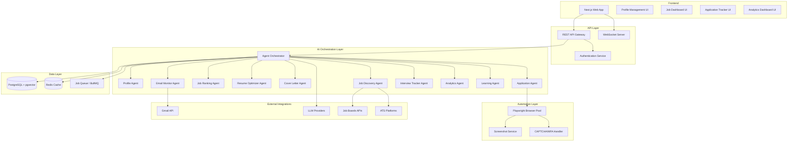
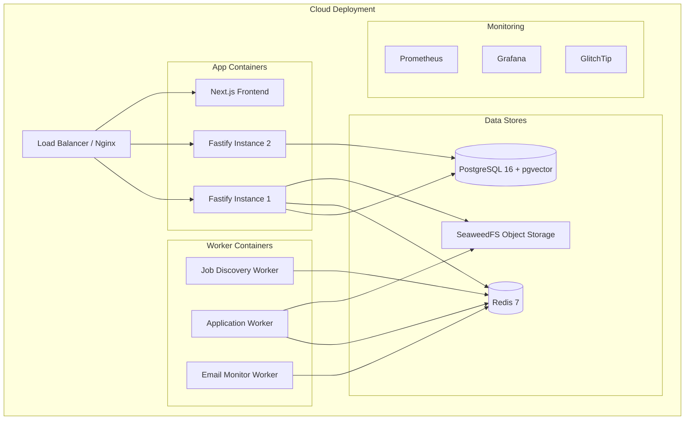
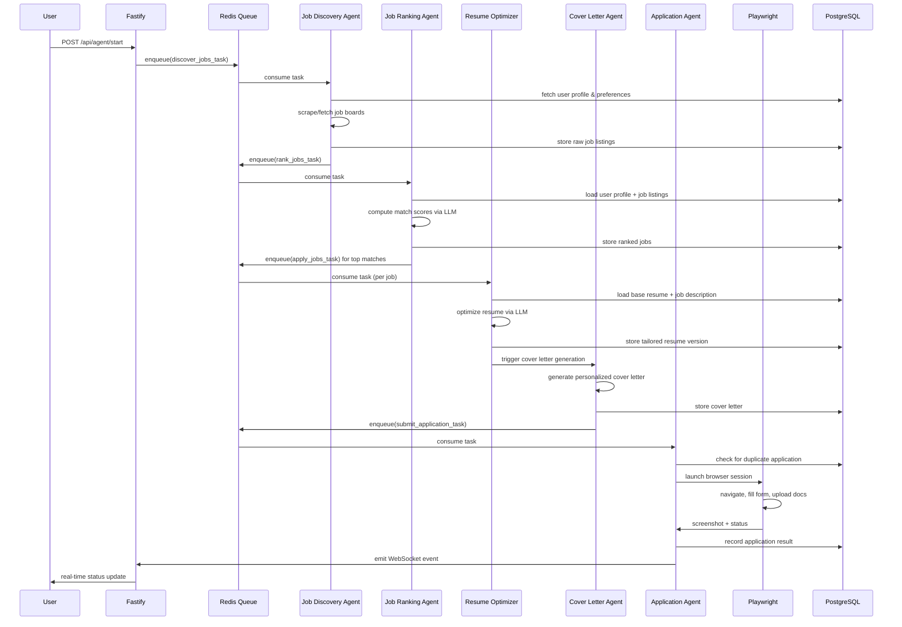
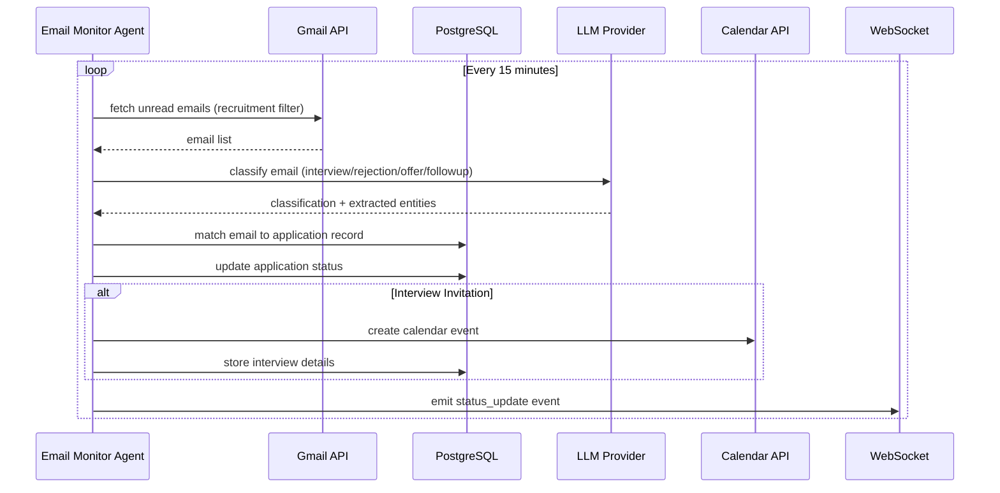

# Design Document: JobPilot AI

## Overview

JobPilot AI is a production-ready AI-powered job application automation platform that manages the end-to-end job application process for software engineers. The system allows users to create a comprehensive professional profile once, then automatically discovers relevant job opportunities from multiple sources (company career pages, ATS platforms like Greenhouse, Lever, Ashby, Workday, SmartRecruiters, Wellfound, Y Combinator Jobs, RemoteOK, Indeed, Naukri, LinkedIn), intelligently ranks them using AI-powered matching, tailors application materials truthfully, automates form submission through browser automation, monitors email for recruitment updates, tracks all applications in a centralized database, and provides analytics on application success rates and trends.

The architecture follows a multi-agent design pattern where specialized AI agents handle distinct responsibilities: profile management, job discovery, job ranking, resume optimization, cover letter generation, application automation, email monitoring, interview tracking, analytics, and continuous learning. The system prioritizes security (encrypted credential storage, role-based access), compliance (respects CAPTCHA/MFA, follows platform policies), truthfulness (never fabricates experience), scalability (queue-based processing, caching), and maintainability (modular clean architecture, structured logging, Docker support).

The technology stack includes Next.js/React/Tailwind CSS/shadcn/ui for the frontend, Fastify (TypeScript/Node.js) for the backend, PostgreSQL + pgvector for primary data storage and vector search, Redis for caching and job queues, Playwright for browser automation, the OpenAI-compatible SDK for LLM orchestration, @xenova/transformers for local embeddings, and configurable free LLM providers (Ollama local models, Google Gemini free tier, Groq free tier, OpenRouter free tier). The system exposes REST and WebSocket APIs for real-time updates, implements comprehensive monitoring and retry logic, and is entirely composed of free and open-source components with no paid cloud services required. The entire stack — frontend and backend — is written in TypeScript.

## Architecture



### System Deployment Diagram



## Sequence Diagrams

### Job Discovery and Application Flow



### Email Monitoring Flow




## Components and Interfaces

### Component 1: Profile Manager

**Purpose**: Manages the user's professional profile including personal info, work experience, education, skills, resume versions, and job preferences. Acts as the single source of truth for all application materials.

**Interface**:
```typescript
interface ProfileManager {
  createProfile(data: CreateProfileRequest): Promise<UserProfile>
  updateProfile(userId: string, data: Partial<UserProfile>): Promise<UserProfile>
  getProfile(userId: string): Promise<UserProfile>
  addResumeVersion(userId: string, resume: ResumeVersion): Promise<ResumeVersion>
  getResumeVersions(userId: string): Promise<ResumeVersion[]>
  selectBestResume(userId: string, jobDescription: JobDescription): Promise<ResumeVersion>
  updateJobPreferences(userId: string, prefs: JobPreferences): Promise<void>
}
```

**Responsibilities**:
- Store and retrieve user profile data with field-level encryption for sensitive info (SSN, salary, phone)
- Manage multiple resume versions tagged by specialization (Backend, Frontend, Full Stack, DevOps, etc.)
- Provide profile completeness scoring and prompt users for missing information
- Expose profile embeddings to the vector store for semantic job matching

---

### Component 2: Job Discovery Agent

**Purpose**: Continuously discovers job postings from multiple sources including ATS platforms, job boards, company career pages, RSS feeds, and APIs.

**Interface**:
```typescript
interface JobDiscoveryAgent {
  startDiscovery(userId: string, config: DiscoveryConfig): Promise<void>
  stopDiscovery(userId: string): Promise<void>
  discoverFromSource(source: JobSource): AsyncIterator<RawJobPosting>
  parseJobDescription(raw: RawJobPosting): Promise<ParsedJobPosting>
  deduplicatePostings(jobs: ParsedJobPosting[]): Promise<ParsedJobPosting[]>
  schedulePeriodicDiscovery(interval: CronExpression): void
}

interface JobSource {
  type: 'api' | 'rss' | 'playwright' | 'webhook'
  platform: SupportedPlatform
  config: SourceConfig
  rateLimit: RateLimitConfig
}

type SupportedPlatform =
  | 'greenhouse' | 'lever' | 'ashby' | 'workday'
  | 'smartrecruiters' | 'wellfound' | 'ycombinator'
  | 'remoteok' | 'indeed' | 'naukri' | 'linkedin'
  | 'twitter_x'   // job links posted on X/Twitter (Playwright scraping of search results)
  | 'custom_url'
```

**Responsibilities**:
- Fetch jobs from supported platforms via their respective APIs, RSS feeds, or browser automation
- Extract structured data: company name, job title, required skills, experience, location, salary, employment type, remote/hybrid, visa requirements, deadlines, application URL
- Deduplicate postings across sources using title + company + URL fingerprinting
- Respect platform rate limits and robots.txt policies
- Queue newly discovered jobs for ranking
- Scrape job links from X (Twitter) search results and LinkedIn job posts (see Social Media Discovery section below)

#### Social Media Job Discovery

**X (Twitter) — Playwright-based link extraction**

X does not provide a jobs API. Discovery works by using Playwright to search for job-related tweets matching configurable search queries (e.g., `"we're hiring" "backend engineer" url:greenhouse.io`). The agent:
1. Navigates to `https://x.com/search?q=<encoded_query>&f=live` using a logged-in X session (user provides their own X credentials, stored encrypted)
2. Scrolls through results and extracts all outbound URLs from tweets (t.co links resolved to final destination)
3. Filters URLs that match known ATS hostnames (greenhouse.io, lever.co, ashby.hq.com, etc.) or job board domains (linkedin.com/jobs, indeed.com/viewjob, etc.)
4. Passes extracted URLs to the standard `parseJobDescription()` pipeline as `source: 'twitter_x'`
5. Rate limit: maximum 3 searches per hour, 50 tweets per search (to avoid X rate limiting)
6. Does NOT attempt to access any paid X API tier — purely Playwright browser automation of the public search UI

**LinkedIn — Playwright-based job link extraction**

LinkedIn's Jobs API requires a paid partner agreement. Discovery uses Playwright on the public jobs search page:
1. Navigates to `https://www.linkedin.com/jobs/search/?keywords=<role>&location=<location>` using a logged-in LinkedIn session (user provides credentials, stored encrypted)
2. Extracts job card URLs, job titles, company names, and locations from the search results page
3. For each job card, follows the link to extract the full job description and application URL
4. Detects the underlying ATS (if the "Easy Apply" button is absent, the job redirects to an external ATS — that URL is captured and used for automation)
5. Rate limit: maximum 20 job cards per session, sessions spaced 10 minutes apart (mimics human browsing speed)
6. If LinkedIn detects automation and shows a CAPTCHA/verification prompt, pauses and notifies the user via the manual intervention flow — never attempts to bypass
7. "Easy Apply" (LinkedIn's native apply flow) is out of scope for this version — only external ATS links are followed

---

### Component 3: Job Ranking Agent

**Purpose**: Scores each job opportunity against the user's profile using an AI-powered matching engine to determine suitability and application priority.

**Interface**:
```typescript
interface JobRankingAgent {
  rankJob(job: ParsedJobPosting, profile: UserProfile): Promise<JobMatch>
  rankBatch(jobs: ParsedJobPosting[], profile: UserProfile): Promise<JobMatch[]>
  computeMatchScore(job: ParsedJobPosting, profile: UserProfile): Promise<MatchScore>
  filterUnsuitable(matches: JobMatch[]): Promise<JobMatch[]>
  getTopOpportunities(userId: string, limit: number): Promise<JobMatch[]>
}

interface MatchScore {
  overall: number            // 0-100
  skillMatch: number         // weighted skill overlap
  experienceMatch: number    // years required vs available
  locationMatch: number      // location preference alignment
  salaryMatch: number        // salary range overlap
  technologyMatch: number    // tech stack alignment
  workAuthMatch: boolean     // visa/authorization compatible
  successProbability: number // historical + LLM prediction
  disqualifiers: string[]    // reasons to skip
}
```

**Responsibilities**:
- Use vector similarity for initial candidate retrieval then LLM re-ranking for precision
- Apply hard filters: work authorization, missing required skills threshold, already applied
- Compute composite match score from multiple signals
- Flag disqualifiers that should cause the job to be skipped
- Learn from historical application outcomes to improve scoring

---

### Component 4: Resume Optimizer Agent

**Purpose**: Tailors the user's selected resume for each specific job description by optimizing formatting, keyword placement, project ordering, and professional summary — without fabricating any information.

**Interface**:
```typescript
interface ResumeOptimizerAgent {
  optimizeResume(
    baseResume: ResumeVersion,
    jobDescription: ParsedJobPosting,
    constraints: OptimizationConstraints
  ): Promise<TailoredResume>
  
  selectBaseResume(
    versions: ResumeVersion[],
    job: ParsedJobPosting
  ): Promise<ResumeVersion>
  
  validateTruthfulness(
    original: ResumeVersion,
    optimized: TailoredResume
  ): Promise<TruthfulnessReport>
  
  exportToPDF(resume: TailoredResume): Promise<Buffer>
}

interface OptimizationConstraints {
  maxPages: number
  preserveAllFacts: boolean     // always true — no fabrication
  keywordsToEmphasize: string[]
  sectionsToReorder: string[]
}
```

**Responsibilities**:
- Reorder projects/experiences to highlight most relevant work for the specific role
- Optimize keyword placement for ATS scanning without stuffing
- Rewrite professional summary to align with role requirements using only true information
- Adjust technical skills section to match job's tech stack (only list skills user actually has)
- Run truthfulness validation to ensure no fabrication has occurred
- Export final resume as PDF for upload

---

### Component 5: Cover Letter Agent

**Purpose**: Generates personalized, truthful cover letters tailored to each specific job and company.

**Interface**:
```typescript
interface CoverLetterAgent {
  generateCoverLetter(
    profile: UserProfile,
    job: ParsedJobPosting,
    tone: CoverLetterTone
  ): Promise<CoverLetter>
  
  generateScreeningAnswers(
    questions: ScreeningQuestion[],
    profile: UserProfile,
    job: ParsedJobPosting
  ): Promise<ScreeningAnswer[]>
  
  getReusableAnswers(userId: string, questionType: string): Promise<string[]>
  storeReusableAnswer(userId: string, qa: QuestionAnswer): Promise<void>
}
```

**Responsibilities**:
- Generate cover letters that reference specific company details and role requirements
- Answer screening questions truthfully based on actual user experience
- Maintain a library of reusable answers for common questions (years of experience, availability, etc.)
- Ensure all generated content is factually consistent with the user's profile

---

### Component 6: Application Automation Agent

**Purpose**: Automates the browser-based job application process using Playwright, including form filling, document uploads, and status tracking.

**Interface**:
```typescript
interface ApplicationAutomationAgent {
  submitApplication(task: ApplicationTask): Promise<ApplicationResult>
  loginToPortal(portal: JobPortal, credentials: PortalCredentials): Promise<BrowserSession>
  fillApplicationForm(session: BrowserSession, answers: FormAnswers): Promise<void>
  uploadDocuments(session: BrowserSession, docs: ApplicationDocuments): Promise<void>
  handleCaptcha(session: BrowserSession): Promise<CaptchaResult>
  captureScreenshot(session: BrowserSession): Promise<Buffer>
  retryFailedApplication(applicationId: string): Promise<ApplicationResult>
}

interface ApplicationResult {
  success: boolean
  applicationId: string
  screenshotPath: string
  confirmationNumber?: string
  failureReason?: string
  requiresManualIntervention: boolean
  retryable: boolean
}
```

**Responsibilities**:
- Manage a pool of browser sessions for concurrent application submissions
- Navigate ATS portals and company career pages
- Fill application forms using stored profile data and generated answers
- Upload resume and cover letter PDFs
- Detect and pause on CAPTCHA/MFA — never attempt to bypass security
- Capture screenshots as proof of successful submission
- Classify failures as retryable (network timeout) vs. non-retryable (auth required)
- Emit real-time progress via WebSocket

---

### Component 7: Email Monitor Agent

**Purpose**: Monitors Gmail for recruitment-related emails and updates application statuses accordingly.

**Interface**:
```typescript
interface EmailMonitorAgent {
  startMonitoring(userId: string, gmailToken: OAuthToken): Promise<void>
  processEmail(email: GmailMessage): Promise<EmailClassification>
  matchEmailToApplication(
    classification: EmailClassification
  ): Promise<ApplicationRecord | null>
  extractInterviewDetails(email: GmailMessage): Promise<InterviewDetails | null>
  createCalendarEvent(interview: InterviewDetails): Promise<void>
}

interface EmailClassification {
  type: 'interview_invite' | 'rejection' | 'offer' | 'assessment' | 'followup' | 'other'
  company: string
  role?: string
  confidence: number
  extractedEntities: Record<string, string>
}
```

**Responsibilities**:
- Poll Gmail API every 15 minutes using label-based filtering
- Classify emails using LLM-based extraction
- Match emails to existing application records using company name + role fuzzy matching
- Update application status in the tracker database
- Extract interview date/time and create Google Calendar events
- Trigger notifications to the user for high-priority emails

---

### Component 8: Analytics Agent

**Purpose**: Generates insights and analytics from application history to help users understand their job search performance and optimize their strategy.

**Interface**:
```typescript
interface AnalyticsAgent {
  getApplicationSummary(userId: string, period: DateRange): Promise<ApplicationSummary>
  getKeywordEffectiveness(userId: string): Promise<KeywordReport>
  getSourcePerformance(userId: string): Promise<SourceReport>
  getInterviewConversionRate(userId: string): Promise<ConversionMetrics>
  generateRecommendations(userId: string): Promise<StrategyRecommendation[]>
}

interface ApplicationSummary {
  totalApplications: number
  interviewRate: number
  rejectionRate: number
  offerRate: number
  pendingCount: number
  applicationsBySource: Record<string, number>
  applicationsByStack: Record<string, number>
  atsSuccessRate: number
  averageResponseTime: number
  weeklyTrend: TrendPoint[]
}
```

**Responsibilities**:
- Aggregate application metrics with configurable date ranges
- Identify which keywords, resume versions, and job sources yield the best response rates
- Surface actionable recommendations (e.g., "Applications to Greenhouse yield 3x more interviews")
- Track historical trends and predict likelihood of success for new applications
- Update `successRate` on `ResumeVersion` records when applications advance past `phone_screen`

---

### Component 9: Interview Prep Agent

**Purpose**: Generates a tailored interview preparation guide for each application, covering likely behavioral and technical questions based on the job description and company.

**Interface**:
```typescript
interface InterviewPrepAgent {
  generatePrepSheet(
    application: ApplicationRecord,
    job: ParsedJobPosting,
    profile: UserProfile
  ): Promise<InterviewPrepSheet>
  
  getCompanyResearch(company: string): Promise<CompanyResearchSummary>
}

interface InterviewPrepSheet {
  applicationId: string
  behavioralQuestions: PrepQuestion[]
  technicalQuestions: PrepQuestion[]
  companySummary: string
  roleSpecificTips: string[]
  generatedAt: Date
}

interface PrepQuestion {
  question: string
  category: 'behavioral' | 'technical' | 'culture' | 'system-design'
  suggestedAnswer?: string  // based on user's actual experience
}
```

**Responsibilities**:
- Generate 5–10 likely interview questions using the free LLM, grounded in the job description
- Suggest answers using only the user's actual profile data (no fabrication)
- Provide a brief company research summary scraped from public sources
- Store prep sheet linked to the application record for later review

---

### Component 10: Notification Manager

**Purpose**: Manages the in-app notification center, storing and delivering events for user attention.

**Interface**:
```typescript
interface NotificationManager {
  createNotification(userId: string, event: NotificationEvent): Promise<Notification>
  getUnread(userId: string): Promise<Notification[]>
  markRead(notificationId: string): Promise<void>
  markAllRead(userId: string): Promise<void>
}

type NotificationEvent =
  | { type: 'application_submitted'; company: string; role: string }
  | { type: 'interview_detected'; company: string; interviewDate?: Date }
  | { type: 'offer_received'; company: string }
  | { type: 'manual_intervention_required'; company: string; jobId: string; screenshot: string }
  | { type: 'source_error'; sourceName: string; reason: string }
  | { type: 'daily_limit_reached'; count: number }
```

**Responsibilities**:
- Persist all notification events to a `notifications` table
- Deliver real-time notifications via WebSocket
- Frontend polls every 30 seconds as fallback for missed WebSocket events
- Unread count shown in navigation header


## Data Models

### UserProfile

```typescript
interface UserProfile {
  id: string                          // UUID
  userId: string                      // FK to auth users
  
  // Personal Information (encrypted at rest)
  fullName: string
  email: string
  phone: string                       // encrypted
  location: string
  linkedinUrl?: string
  githubUrl?: string
  portfolioUrl?: string
  websiteUrl?: string
  
  // Work Authorization
  workAuthorization: WorkAuthType[]   // e.g., ['US_CITIZEN', 'H1B']
  requiresSponsorship: boolean
  noticePeriod: number                // days
  
  // Preferences
  preferences: JobPreferences
  
  // Professional Data
  experiences: WorkExperience[]
  education: Education[]
  projects: Project[]
  skills: Skill[]
  certifications: Certification[]
  
  // Metadata
  profileCompleteness: number         // 0-100
  createdAt: Date
  updatedAt: Date
}

interface JobPreferences {
  targetRoles: string[]               // e.g., ['Backend Engineer', 'Senior SWE']
  preferredLocations: string[]
  remotePreference: 'remote_only' | 'hybrid' | 'onsite' | 'flexible'
  salaryMin: number                   // encrypted
  salaryMax: number                   // encrypted
  currency: string
  employmentTypes: EmploymentType[]
  excludedCompanies: string[]
  preferredCompanies: string[]        // boosted 1.2× score multiplier
  targetIndustries: string[]
  targetCompanySizes: CompanySize[]
  dailyApplyLimit: number             // default: 10, max: 50
  autoPauseEnabled: boolean           // pause when manual intervention pending
  coverLetterReviewMode: 'auto' | 'review_first'  // review before submitting
}
```

**Validation Rules**:
- `email` must be valid email format and unique per user
- `workAuthorization` must contain at least one value
- `noticePeriod` must be >= 0
- `salaryMin` must be <= `salaryMax`
- `preferences.targetRoles` must have at least one entry

---

### ResumeVersion

```typescript
interface ResumeVersion {
  id: string
  userId: string
  name: string                        // e.g., 'Backend Engineer v2'
  specialization: ResumeSpecialization
  fileUrl: string                     // S3/storage path
  fileHash: string                    // SHA-256 for dedup
  content: ResumeContent             // structured parsed content
  isDefault: boolean
  usageCount: number
  lastUsedAt?: Date
  successRate?: number                // interview rate when used
  createdAt: Date
  updatedAt: Date
}

type ResumeSpecialization = 
  | 'backend' | 'frontend' | 'fullstack'
  | 'devops' | 'cloud' | 'ai_ml' 
  | 'mobile' | 'data' | 'general'

interface ResumeContent {
  summary: string
  experiences: WorkExperience[]
  education: Education[]
  projects: Project[]
  skills: SkillSection[]
  certifications: Certification[]
  rawText: string                     // for full-text search
  embedding?: number[]               // vector embedding
}
```

---

### JobPosting

```typescript
interface JobPosting {
  id: string
  externalId: string                  // platform's job ID
  sourceUrl: string
  platform: SupportedPlatform
  fingerprint: string                 // hash(title+company+url) for dedup
  
  // Extracted Fields
  company: string
  title: string
  description: string
  descriptionHtml: string
  requiredSkills: string[]
  preferredSkills: string[]
  yearsExperienceMin?: number
  yearsExperienceMax?: number
  location: string[]
  isRemote: boolean
  isHybrid: boolean
  salaryMin?: number
  salaryMax?: number
  currency?: string
  employmentType: EmploymentType
  visaRequirements?: string[]
  applicationDeadline?: Date
  applicationUrl: string
  atsType?: AtsType
  
  // Processing Metadata
  discoveredAt: Date
  parsedAt?: Date
  embeddingVector?: number[]
  rawData: Record<string, unknown>
  
  status: 'new' | 'parsed' | 'ranked' | 'applied' | 'expired' | 'skipped'
}
```

---

### ApplicationRecord

```typescript
interface ApplicationRecord {
  id: string
  userId: string
  jobPostingId: string
  
  // Application Details
  appliedAt: Date
  source: SupportedPlatform
  applicationUrl: string
  resumeVersionId: string
  coverLetterPath?: string
  
  // Status Tracking
  status: ApplicationStatus
  statusHistory: StatusTransition[]
  
  // Automation Metadata
  automationSessionId?: string
  screenshotPaths: string[]
  confirmationNumber?: string
  formAnswersSnapshot: Record<string, string>
  
  // Results
  interviewRounds: InterviewRound[]
  offerDetails?: OfferDetails
  rejectionReason?: string
  notes: string
  
  // Scores (at time of application)
  matchScoreSnapshot: MatchScore
  
  createdAt: Date
  updatedAt: Date
}

type ApplicationStatus =
  | 'draft' | 'submitted' | 'under_review' | 'phone_screen'
  | 'technical_interview' | 'final_round' | 'offer_received'
  | 'offer_accepted' | 'offer_declined' | 'rejected'
  | 'withdrawn' | 'ghosted' | 'failed_submission'

interface StatusTransition {
  from: ApplicationStatus
  to: ApplicationStatus
  triggeredBy: 'user' | 'email_monitor' | 'automation'
  timestamp: Date
  note?: string
}
```

---

### AgentTask

```typescript
interface AgentTask {
  id: string
  type: AgentTaskType
  userId: string
  payload: Record<string, unknown>
  priority: 'critical' | 'high' | 'normal' | 'low'
  status: 'queued' | 'processing' | 'completed' | 'failed' | 'retrying'
  attempts: number
  maxAttempts: number
  lastError?: string
  scheduledAt: Date
  startedAt?: Date
  completedAt?: Date
  createdAt: Date
}

type AgentTaskType =
  | 'discover_jobs' | 'rank_jobs' | 'optimize_resume'
  | 'generate_cover_letter' | 'submit_application'
  | 'monitor_emails' | 'update_analytics' | 'retry_failed'
  | 'generate_interview_prep'
```

---

### Notification

```typescript
interface Notification {
  id: string
  userId: string
  type: NotificationEventType
  title: string
  body: string
  metadata: Record<string, unknown>  // e.g., { jobId, company, screenshotUrl }
  isRead: boolean
  createdAt: Date
  readAt?: Date
}
```

---

### JobSource Configuration

```typescript
interface JobSourceConfig {
  id: string
  userId: string
  platform: SupportedPlatform
  enabled: boolean
  config: SourceConfig               // API keys, URLs, search keywords
  lastRunAt?: Date
  lastRunStatus: 'success' | 'error' | 'rate_limited' | 'never_run'
  lastRunJobsFound: number
  errorMessage?: string
  createdAt: Date
}

// Extended config shapes for social media sources
interface TwitterXSourceConfig extends SourceConfig {
  searchQueries: string[]            // e.g., ["we're hiring backend engineer greenhouse.io"]
  maxSearchesPerHour: number         // default: 3
  targetAtsHostnames: string[]       // filter for known ATS domains
}

interface LinkedInSourceConfig extends SourceConfig {
  searchKeywords: string[]           // job title keywords
  locations: string[]                // location filters
  maxJobCardsPerSession: number      // default: 20
  sessionIntervalMinutes: number     // default: 10
  skipEasyApply: boolean             // default: true (only follow external ATS links)
}
```


## Algorithmic Pseudocode

### Main Job Application Orchestration Algorithm

```pascal
ALGORITHM orchestrate_job_applications(user_id)
INPUT: user_id: UUID of the authenticated user
OUTPUT: session_report: OrchestrationReport

BEGIN
  ASSERT user_exists(user_id) = true
  ASSERT profile_complete(user_id) >= 70  // minimum completeness threshold

  profile ← load_user_profile(user_id)
  session_id ← generate_session_id()
  
  // Phase 1: Discover new job postings
  raw_jobs ← []
  FOR EACH source IN get_enabled_sources(profile.preferences) DO
    source_jobs ← discover_from_source(source, profile.preferences)
    raw_jobs ← raw_jobs UNION source_jobs
  END FOR
  
  parsed_jobs ← parse_job_descriptions(raw_jobs)
  unique_jobs ← deduplicate_postings(parsed_jobs)
  store_job_postings(unique_jobs)
  
  // Phase 2: Rank and filter
  ranked_jobs ← []
  FOR EACH job IN unique_jobs DO
    IF already_applied(user_id, job.fingerprint) THEN
      CONTINUE
    END IF
    match ← compute_match_score(job, profile)
    IF match.has_hard_disqualifier() THEN
      mark_job_skipped(job.id, match.disqualifiers)
      CONTINUE
    END IF
    ranked_jobs.append((job, match))
  END FOR
  
  ranked_jobs ← sort_by(ranked_jobs, key=match.overall, order=DESC)
  daily_limit ← profile.preferences.daily_apply_limit  // default: 10
  top_jobs ← ranked_jobs[0..daily_limit]
  
  // Phase 3: Prepare and submit applications
  results ← []
  FOR EACH (job, match) IN top_jobs DO
    ASSERT NOT already_applied(user_id, job.fingerprint)
    
    base_resume ← select_best_resume(profile.resume_versions, job)
    tailored_resume ← optimize_resume(base_resume, job)
    
    ASSERT truthfulness_check(base_resume, tailored_resume) = PASS
    
    cover_letter ← generate_cover_letter(profile, job)
    
    // If review mode is enabled, pause and wait for user approval
    IF profile.preferences.cover_letter_review_mode = 'review_first' THEN
      emit_websocket_event(user_id, 'cover_letter_pending_review', {job_id: job.id, cover_letter})
      approval ← await_user_approval(user_id, job.id, timeout=24h)
      IF NOT approval.approved THEN
        cover_letter ← approval.edited_version  // use user's edited version
      END IF
    END IF
    
    screening_answers ← generate_screening_answers(job.screening_questions, profile)
    
    result ← submit_application(
      user_id, job, tailored_resume, cover_letter, screening_answers
    )
    
    record_application(user_id, job, result, match)
    results.append(result)
    
    SLEEP rate_limit_delay(job.platform)
  END FOR
  
  // Phase 4: Generate session report
  report ← build_session_report(session_id, results)
  emit_websocket_event(user_id, 'session_complete', report)
  
  RETURN report
END
```

**Preconditions**:
- User profile exists and has minimum 70% completeness
- At least one job source is configured and enabled
- AI provider credentials are valid and responsive
- Playwright browser pool has available sessions

**Postconditions**:
- All discovered jobs are stored in the database (with dedup)
- Each top-ranked job either has an application record or a skip record
- No application is submitted twice for the same (user, job fingerprint) pair
- All tailored resumes pass the truthfulness check before submission
- Session report accurately reflects all actions taken

**Loop Invariants**:
- For the discovery loop: `raw_jobs` grows monotonically; no source is called twice
- For the ranking loop: Every processed job either gets a match score or is marked skipped
- For the application loop: `already_applied` guard prevents duplicate submissions at each iteration

---

### Job Match Scoring Algorithm

```pascal
ALGORITHM compute_match_score(job, profile)
INPUT: 
  job: ParsedJobPosting
  profile: UserProfile
OUTPUT: match: MatchScore (overall score 0-100, component scores, disqualifiers)

BEGIN
  disqualifiers ← []
  
  // Hard disqualifier checks (exit early if any fail)
  IF job.requires_visa_sponsorship AND NOT profile.requires_sponsorship THEN
    disqualifiers.append("visa_sponsorship_not_available")
  END IF
  
  IF NOT work_auth_compatible(job.visa_requirements, profile.work_authorization) THEN
    disqualifiers.append("work_authorization_incompatible")
    RETURN MatchScore(overall=0, disqualifiers=disqualifiers)
  END IF
  
  required_skills_present ← COUNT(
    s FOR s IN job.required_skills WHERE s IN profile.skills
  )
  required_coverage ← required_skills_present / COUNT(job.required_skills)
  
  IF required_coverage < 0.5 THEN  // less than 50% of required skills
    disqualifiers.append("insufficient_required_skills")
    RETURN MatchScore(overall=0, disqualifiers=disqualifiers)
  END IF
  
  // Component score calculations
  skill_score ← compute_skill_score(job.required_skills, job.preferred_skills, profile.skills)
  experience_score ← compute_experience_score(job.years_experience_min, profile.total_years_exp)
  location_score ← compute_location_score(job.location, job.is_remote, profile.preferences)
  salary_score ← compute_salary_score(job.salary_min, job.salary_max, profile.preferences.salary)
  tech_score ← compute_tech_stack_score(job, profile)
  
  // LLM-based holistic scoring
  llm_score ← llm_evaluate_fit(job.description, profile.summary_embedding)
  
  // Historical performance adjustment
  historical_factor ← get_historical_success_rate(
    platform=job.platform,
    role_category=categorize_role(job.title),
    tech_stack=job.required_skills
  )
  
  // Preferred company boost
  IF job.company IN profile.preferences.preferred_companies THEN
    preferred_boost ← 1.20  // 20% boost for explicitly preferred companies
  ELSE
    preferred_boost ← 1.0
  END IF
  
  // Weighted composite score
  overall ← (
    skill_score      * 0.35 +
    experience_score * 0.20 +
    location_score   * 0.15 +
    salary_score     * 0.10 +
    tech_score       * 0.10 +
    llm_score        * 0.10
  ) * historical_factor * preferred_boost
  
  success_probability ← estimate_success_probability(overall, historical_factor, profile)
  
  RETURN MatchScore(
    overall=CLAMP(overall, 0, 100),
    skill_match=skill_score,
    experience_match=experience_score,
    location_match=location_score,
    salary_match=salary_score,
    technology_match=tech_score,
    work_auth_match=true,
    success_probability=success_probability,
    disqualifiers=disqualifiers
  )
END
```

**Preconditions**:
- `job.required_skills` is a non-empty list
- `profile.skills` is populated
- `profile.work_authorization` contains at least one value
- LLM provider is available (with fallback to score=50 on failure)

**Postconditions**:
- If any hard disqualifier is present, `overall = 0`
- `overall` is always in range [0, 100]
- `disqualifiers` is empty if and only if no hard disqualifiers were found
- Component scores are individually in range [0, 100]

---

### Resume Optimization Algorithm

```pascal
ALGORITHM optimize_resume(base_resume, job_description)
INPUT:
  base_resume: ResumeVersion (user's actual resume — source of truth)
  job_description: ParsedJobPosting
OUTPUT:
  tailored_resume: TailoredResume

BEGIN
  // Step 1: Extract job keywords and requirements
  keywords ← extract_keywords(job_description.description)
  required_skills ← job_description.required_skills
  preferred_skills ← job_description.preferred_skills
  
  // Step 2: Identify relevant experiences from base resume (NO fabrication)
  scored_experiences ← []
  FOR EACH exp IN base_resume.content.experiences DO
    relevance ← compute_experience_relevance(exp, required_skills, keywords)
    scored_experiences.append((exp, relevance))
  END FOR
  
  // Sort by relevance descending (reorder only — nothing fabricated)
  reordered_experiences ← sort_by(scored_experiences, key=relevance, order=DESC)
  
  // Step 3: Reorder projects by relevance
  scored_projects ← []
  FOR EACH proj IN base_resume.content.projects DO
    relevance ← compute_project_relevance(proj, required_skills, keywords)
    scored_projects.append((proj, relevance))
  END FOR
  reordered_projects ← sort_by(scored_projects, key=relevance, order=DESC)
  
  // Step 4: Filter skills section to emphasize matching skills
  // CONSTRAINT: Only include skills the user actually has
  user_skill_set ← SET(base_resume.content.skills)
  emphasized_skills ← INTERSECTION(user_skill_set, SET(required_skills) UNION SET(preferred_skills))
  other_skills ← user_skill_set MINUS emphasized_skills
  reordered_skills ← emphasized_skills CONCAT other_skills
  
  // Step 5: Generate optimized summary via LLM
  // LLM prompt explicitly constrained: "Use ONLY facts from the provided resume"
  optimized_summary ← llm_generate_summary(
    original_summary=base_resume.content.summary,
    job_description=job_description,
    constraint="Use ONLY information present in the original summary. Do not add any new claims."
  )
  
  // Step 6: Assemble tailored resume
  tailored ← TailoredResume(
    base_resume_id=base_resume.id,
    experiences=reordered_experiences,
    projects=reordered_projects,
    skills=reordered_skills,
    summary=optimized_summary,
    education=base_resume.content.education,       // unchanged
    certifications=base_resume.content.certifications  // unchanged
  )
  
  // Step 7: Truthfulness validation
  validation ← validate_truthfulness(base_resume, tailored)
  IF validation.has_fabrications THEN
    LOG_ERROR("Fabrication detected", validation.violations)
    RETURN base_resume  // fall back to original
  END IF
  
  RETURN tailored
END
```

**Preconditions**:
- `base_resume` contains validated, user-verified content
- `job_description.description` is non-empty
- LLM is available (with fallback to base resume on failure)

**Postconditions**:
- Returned resume contains only facts present in `base_resume`
- No new experiences, projects, skills, or certifications are added
- All reordering operations are information-preserving (no content removed)
- If truthfulness validation fails, original `base_resume` is returned unchanged

**Loop Invariants**:
- Experience loop: `COUNT(reordered_experiences) == COUNT(base_resume.content.experiences)` at all times
- Project loop: `COUNT(reordered_projects) == COUNT(base_resume.content.projects)` at all times
- Skills filter: Result is always a strict subset of user's actual skills

---

### Playwright Application Submission Algorithm

```pascal
ALGORITHM submit_application(user_id, job, tailored_resume, cover_letter, screening_answers)
INPUT:
  user_id: UUID
  job: ParsedJobPosting
  tailored_resume: TailoredResume (as PDF buffer)
  cover_letter: CoverLetter (as PDF buffer)
  screening_answers: ScreeningAnswer[]
OUTPUT:
  result: ApplicationResult

BEGIN
  ASSERT NOT already_applied(user_id, job.fingerprint)
  
  session ← acquire_browser_session(pool)
  
  TRY
    // Navigate to application page
    page ← session.new_page()
    page.goto(job.application_url, timeout=30s)
    
    // Handle portal login if required
    IF requires_login(job.platform) THEN
      credentials ← get_portal_credentials(user_id, job.platform)
      IF credentials IS NULL THEN
        RETURN ApplicationResult(
          success=false,
          requires_manual_intervention=true,
          failure_reason="portal_credentials_missing"
        )
      END IF
      login_result ← login_to_portal(page, credentials)
      IF NOT login_result.success THEN
        RETURN ApplicationResult(success=false, failure_reason="login_failed", retryable=false)
      END IF
    END IF
    
    // Detect and populate form fields
    form_fields ← detect_form_fields(page)
    
    FOR EACH field IN form_fields DO
      answer ← resolve_field_answer(field, user_id, screening_answers)
      IF answer IS NOT NULL THEN
        fill_field(page, field, answer)
      END IF
    END FOR
    
    // Upload documents
    resume_field ← find_upload_field(page, type='resume')
    IF resume_field EXISTS THEN
      upload_file(page, resume_field, tailored_resume.pdf_buffer, filename="resume.pdf")
    END IF
    
    cover_letter_field ← find_upload_field(page, type='cover_letter')
    IF cover_letter_field EXISTS THEN
      upload_file(page, cover_letter_field, cover_letter.pdf_buffer, filename="cover_letter.pdf")
    END IF
    
    // Check for CAPTCHA before submitting
    IF captcha_detected(page) THEN
      screenshot ← capture_screenshot(page)
      RETURN ApplicationResult(
        success=false,
        requires_manual_intervention=true,
        failure_reason="captcha_detected",
        screenshot_path=store_screenshot(screenshot),
        retryable=false
      )
    END IF
    
    // Submit the application
    submit_button ← find_submit_button(page)
    submit_button.click()
    
    // Wait for confirmation
    confirmation ← wait_for_confirmation(page, timeout=15s)
    screenshot ← capture_screenshot(page)
    screenshot_path ← store_screenshot(screenshot)
    
    IF confirmation.success THEN
      RETURN ApplicationResult(
        success=true,
        confirmation_number=confirmation.number,
        screenshot_path=screenshot_path,
        requires_manual_intervention=false,
        retryable=false
      )
    ELSE
      RETURN ApplicationResult(
        success=false,
        failure_reason=confirmation.error,
        screenshot_path=screenshot_path,
        retryable=is_retryable_error(confirmation.error)
      )
    END IF
    
  CATCH NetworkError AS e
    RETURN ApplicationResult(success=false, failure_reason=e.message, retryable=true)
  CATCH TimeoutError AS e
    RETURN ApplicationResult(success=false, failure_reason="timeout", retryable=true)
  CATCH UnexpectedPageError AS e
    screenshot ← capture_screenshot(page)
    RETURN ApplicationResult(
      success=false,
      failure_reason="unexpected_page_state",
      screenshot_path=store_screenshot(screenshot),
      retryable=false
    )
  FINALLY
    release_browser_session(pool, session)
  END TRY
END
```

**Preconditions**:
- `already_applied(user_id, job.fingerprint) = false`
- Browser session pool has available capacity
- `tailored_resume.pdf_buffer` is non-null and valid PDF
- `job.application_url` is accessible

**Postconditions**:
- Browser session is always released back to pool (via FINALLY)
- A screenshot is captured for all non-trivial outcomes
- CAPTCHA and MFA are never bypassed — always returned as manual intervention needed
- `retryable = true` only for transient errors (network, timeout)


## Key Functions with Formal Specifications

### `discoverFromSource(source, preferences)`

```typescript
async function* discoverFromSource(
  source: JobSource,
  preferences: JobPreferences
): AsyncGenerator<RawJobPosting>
```

**Preconditions**:
- `source.config` contains valid credentials/URLs for the platform
- `preferences.target_roles` is non-empty
- Rate limit budget for `source.platform` is not exhausted

**Postconditions**:
- Each yielded `RawJobPosting` contains at minimum: `source_url`, `raw_html` or `raw_json`, `platform`, `discovered_at`
- Total requests do not exceed `source.rate_limit.max_requests_per_minute`
- On network failure, yields nothing and logs error (no exception propagation)

**Loop Invariants**:
- Pagination loop: Each page fetch uses the cursor/offset from the previous response
- At each iteration, `discovered_count` increases by the number of jobs on that page

---

### `computeSkillScore(required, preferred, user_skills)`

```typescript
function computeSkillScore(
  required: string[],
  preferred: string[],
  userSkills: Skill[]
): number // returns 0.0 to 100.0
```

**Preconditions**:
- `required` is non-empty
- `user_skills` is non-empty
- All inputs are normalized to lowercase for comparison

**Postconditions**:
- Return value is in `[0.0, 100.0]`
- If user has all required AND all preferred skills → score approaches 100
- If user has 0 required skills → score = 0
- Score is monotonically non-decreasing as user skills grow

---

### `validateTruthfulness(original, optimized)`

```typescript
function validateTruthfulness(
  original: ResumeVersion,
  optimized: TailoredResume
): TruthfulnessReport
```

**Preconditions**:
- `original.content` is the immutable source of truth
- `optimized` was produced by the `optimize_resume` function

**Postconditions**:
- If `has_fabrications = true`, `violations` is non-empty and describes each violation
- If `has_fabrications = false`, every claim in `optimized` exists verbatim or as a reformulation in `original`
- Function has no side effects

---

### `recordApplication(userId, job, result, matchScore)`

```typescript
async function recordApplication(
  userId: string,
  job: ParsedJobPosting,
  result: ApplicationResult,
  matchScore: MatchScore
): Promise<ApplicationRecord>
```

**Preconditions**:
- No existing `ApplicationRecord` exists for `(user_id, job.fingerprint)` — checked via unique constraint
- `result` contains at minimum: `success`, `screenshot_paths`

**Postconditions**:
- Exactly one `ApplicationRecord` row is inserted in the database
- `application.status` = `'submitted'` if `result.success`, else `'failed_submission'`
- `application.match_score_snapshot` is an immutable copy of `match_score` at time of recording
- On database write failure, raises exception (caller handles retry)

---

### `classifyEmail(email)`

```typescript
async function classifyEmail(
  email: GmailMessage
): Promise<EmailClassification>
```

**Preconditions**:
- `email.body` is non-empty (plain text extracted from HTML)
- LLM provider is accessible

**Postconditions**:
- `classification.type` is one of the defined `EmailType` enum values
- `classification.confidence` is in `[0.0, 1.0]`
- `classification.company` is extracted from email sender domain or body content
- On LLM failure, returns `EmailClassification(type='other', confidence=0.0)` as safe fallback

---

### `getTopOpportunities(userId, limit)`

```typescript
async function getTopOpportunities(
  userId: string,
  limit: number
): Promise<JobMatch[]>
```

**Preconditions**:
- `limit` >= 1 and <= 100
- User has at least one job source configured

**Postconditions**:
- Returns at most `limit` results
- Results are sorted by `match.overall` descending
- No result has `overall = 0` (hard-disqualified jobs excluded)
- No result corresponds to an already-applied job for this user


## Example Usage

### Example 1: Starting the Job Application Agent

```typescript
// Frontend: User initiates job application session
const response = await fetch('/api/agent/start', {
  method: 'POST',
  headers: { 'Authorization': `Bearer ${token}` },
  body: JSON.stringify({
    userId: 'user-123',
    maxApplications: 10,
    sources: ['greenhouse', 'lever', 'wellfound']
  })
})

const { sessionId } = await response.json()

// Listen for real-time updates via WebSocket
const ws = new WebSocket(`wss://api.jobpilot.ai/ws?sessionId=${sessionId}`)
ws.onmessage = (event) => {
  const update = JSON.parse(event.data)
  console.log(`Status: ${update.type}`, update.payload)
  
  if (update.type === 'job_discovered') {
    displayJobCard(update.payload.job)
  }
  
  if (update.type === 'application_submitted') {
    showNotification(`Applied to ${update.payload.company}!`)
  }
}
```

---

### Example 2: Job Ranking Flow

```typescript
// Backend: Rank a batch of discovered jobs
import { JobRankingAgent } from './agents/ranking'
import { prisma } from './core/database'

const agent = new JobRankingAgent({ llmClient: getLLMClient() })
const profile = await prisma.profile.findUniqueOrThrow({ where: { userId: 'user-123' } })
const jobs = await prisma.jobPosting.findMany({ where: { status: 'new' }, take: 50 })

const matches = await agent.rankBatch(jobs, profile)

for (const match of matches) {
  if (match.score.overall < 60 || match.score.disqualifiers.length > 0) {
    await prisma.jobPosting.update({ where: { id: match.job.id }, data: { status: 'skipped' } })
    continue
  }
  await prisma.jobMatch.create({
    data: { userId: profile.userId, jobPostingId: match.job.id, matchScore: match.score, rank: match.rank }
  })
}
```

---

### Example 3: Resume Optimization with Truthfulness Check

```typescript
// Backend: Optimize resume for a specific job
import { ResumeOptimizerAgent } from './agents/resumeOptimizer'
import { logger } from './core/logging'

const optimizer = new ResumeOptimizerAgent({ llmClient: getLLMClient() })

const baseResume = await prisma.resumeVersion.findUniqueOrThrow({ where: { id: 'resume-456' } })
const job = await prisma.jobPosting.findUniqueOrThrow({ where: { id: 'job-789' } })

const tailored = await optimizer.optimizeResume(baseResume, job, {
  maxPages: 2,
  preserveAllFacts: true,           // always enforced
  keywordsToEmphasize: job.requiredSkills.slice(0, 10)
})

// Validate truthfulness before using
const validation = optimizer.validateTruthfulness(baseResume, tailored)

if (validation.hasFabrications) {
  logger.error('Fabrication detected', { violations: validation.violations })
  // Fall back to original resume
  const pdfBuffer = await generatePdf(baseResume)
  await submitApplication(userId, job, pdfBuffer)
} else {
  const pdfBuffer = await generatePdf(tailored)
  await submitApplication(userId, job, pdfBuffer)
}
```

---

### Example 4: Playwright Application Automation

```typescript
// Backend: Submit application via browser automation
import { ApplicationAutomationAgent } from './agents/applicationAgent'

const agent = new ApplicationAutomationAgent({ browserPool })

const task: ApplicationTask = {
  userId: 'user-123',
  jobId: 'job-789',
  tailoredResumePath: 'resumes/user-123/tailored-789.pdf',
  coverLetterPath: 'letters/user-123/letter-789.pdf',
  screeningAnswers: { years_experience: '5', authorized_to_work: 'Yes' }
}

const result = await agent.submitApplication(task)

if (result.success) {
  await prisma.applicationRecord.create({
    data: {
      userId: task.userId,
      jobPostingId: task.jobId,
      status: 'submitted',
      confirmationNumber: result.confirmationNumber,
      screenshotPaths: [result.screenshotPath],
      appliedAt: new Date()
    }
  })
} else if (result.requiresManualIntervention) {
  await notificationManager.create(task.userId, {
    type: 'manual_intervention_required',
    jobId: task.jobId,
    reason: result.failureReason,
    screenshot: result.screenshotPath
  })
} else if (result.retryable) {
  // Re-queue with exponential backoff via BullMQ
  await applicationQueue.add('submit', task, {
    delay: Math.pow(2, result.attemptNumber) * 1000,
    attempts: 3
  })
}
```

---

### Example 5: Email Monitoring and Status Updates

```typescript
// Backend Worker: Process recruitment emails
import { EmailMonitorAgent } from './agents/emailMonitor'
import { GmailClient } from './integrations/gmail'

const agent = new EmailMonitorAgent({ llmClient: getLLMClient() })
const gmail = new GmailClient({ oauthToken: user.gmailToken })

// Fetch unread emails with recruitment label
const emails = await gmail.fetchUnread({ label: 'recruitment' })

for (const email of emails) {
  const classification = await agent.processEmail(email)

  if (classification.confidence < 0.7) continue  // skip low-confidence

  const app = await agent.matchEmailToApplication(classification)

  if (!app) {
    logger.warn('Could not match email', { company: classification.company })
    continue
  }

  if (classification.type === 'interview_invite') {
    await prisma.applicationRecord.update({
      where: { id: app.id }, data: { status: 'phone_screen' }
    })
    const interview = await agent.extractInterviewDetails(email)
    if (interview) await agent.createCalendarEvent(interview)
  } else if (classification.type === 'rejection') {
    await prisma.applicationRecord.update({
      where: { id: app.id }, data: { status: 'rejected' }
    })
  } else if (classification.type === 'offer') {
    await prisma.applicationRecord.update({
      where: { id: app.id }, data: { status: 'offer_received' }
    })
    await notificationManager.create(app.userId, { type: 'offer_received', company: classification.company })
  }

  await gmail.markRead(email.id)
}
```

---

### Example 6: Analytics Dashboard Query

```typescript
// Backend: Generate analytics report
import { AnalyticsAgent } from './agents/analytics'

const agent = new AnalyticsAgent({ db: prisma })

// Get last 30 days summary
const summary = await agent.getApplicationSummary({
  userId: 'user-123',
  period: {
    start: new Date(Date.now() - 30 * 24 * 60 * 60 * 1000),
    end: new Date()
  }
})

console.log(`Total Applications: ${summary.totalApplications}`)
console.log(`Interview Rate: ${(summary.interviewRate * 100).toFixed(1)}%`)
console.log(`Offer Rate: ${(summary.offerRate * 100).toFixed(1)}%`)

// Get keyword effectiveness report
const keywords = await agent.getKeywordEffectiveness({ userId: 'user-123' })

console.log('\nTop Keywords by Response Rate:')
for (const kw of keywords.topKeywords.slice(0, 10)) {
  console.log(`  ${kw.keyword}: ${(kw.responseRate * 100).toFixed(1)}% (${kw.appearances} appearances)`)
}
```


## Correctness Properties

These properties must hold at all times and are enforceable as assertions, database constraints, and property-based tests.

### Property 1: No Duplicate Applications

```
∀ user_id ∈ Users, ∀ job_fingerprint ∈ Jobs :
  COUNT(ApplicationRecord WHERE user_id = user_id AND job_fingerprint = job_fingerprint) ≤ 1
```

Enforced by: unique database constraint on `(user_id, job_fingerprint)` in `application_records` table.

---

### Property 2: Truthfulness Preservation

```
∀ tailored ∈ TailoredResumes, ∀ base ∈ ResumeVersions :
  tailored.base_resume_id = base.id →
  (∀ claim ∈ tailored.content : claim ∈ base.content)
```

Enforced by: `validate_truthfulness()` check before every application submission; fallback to original resume on violation.

---

### Property 3: CAPTCHA/MFA Non-Bypass

```
∀ session ∈ BrowserSessions :
  captcha_detected(session) ∨ mfa_detected(session) →
  result.requires_manual_intervention = true ∧ result.success = false
```

Enforced by: Playwright automation code structure — no bypass path exists in the implementation.

---

### Property 4: Work Authorization Compatibility

```
∀ application ∈ ApplicationRecords :
  application.status ≠ 'failed_submission' →
  work_auth_compatible(application.job.visa_requirements, application.user.work_authorization) = true
```

Enforced by: Hard filter in `compute_match_score()` — incompatible jobs receive `overall = 0` and are skipped.

---

### Property 5: Match Score Non-Negativity and Boundedness

```
∀ match ∈ MatchScores :
  0 ≤ match.overall ≤ 100 ∧
  0 ≤ match.skill_match ≤ 100 ∧
  0 ≤ match.experience_match ≤ 100 ∧
  0 ≤ match.success_probability ≤ 1.0
```

Enforced by: `CLAMP` operations in score calculation and database check constraints.

---

### Property 6: Browser Session Release Guarantee

```
∀ session ∈ BrowserSessions acquired in submit_application :
  session is always released back to pool regardless of outcome
```

Enforced by: FINALLY block in `submit_application` algorithm — session release is unconditional.

---

### Property 7: Application Records Immutability of Match Score Snapshot

```
∀ application ∈ ApplicationRecords :
  application.match_score_snapshot = the MatchScore at time of application creation ∧
  application.match_score_snapshot is never mutated after creation
```

Enforced by: `match_score_snapshot` column is write-once (no UPDATE permitted by application layer).

---

### Property 8: Rate Limit Compliance

```
∀ source ∈ JobSources, ∀ window ∈ TimeWindows(1_minute) :
  COUNT(requests_to(source) during window) ≤ source.rate_limit.max_requests_per_minute
```

Enforced by: Token bucket rate limiter in the job discovery agent per platform.

---

### Property 9: Profile Completeness Gate

```
∀ orchestration_session : session.started →
  profile_completeness(session.user_id) ≥ 70
```

Enforced by: Pre-condition check in `orchestrate_job_applications` with HTTP 422 response if violated.

---

### Property 10: Email Classification Safe Fallback

```
∀ email ∈ ProcessedEmails :
  llm_unavailable → classification.type = 'other' ∧ classification.confidence = 0.0
```

Enforced by: Try/except in `classify_email()` with explicit fallback return value.

---

### Property 11: Social Media Discovery Rate Limit Compliance

```
∀ session ∈ TwitterXSessions, ∀ hour_window ∈ TimeWindows(60_min) :
  COUNT(searches_in(session, hour_window)) ≤ 3

∀ session ∈ LinkedInSessions, ∀ session_pair ∈ ConsecutiveSessions :
  time_between(session_pair.first, session_pair.second) ≥ 10_minutes ∧
  COUNT(job_cards_fetched(session)) ≤ 20
```

Enforced by: Per-source token bucket rate limiter; session scheduling enforces minimum gap between LinkedIn sessions.

---

### Property 12: Social Media URL Safety

```
∀ url ∈ ExtractedTwitterXUrls ∪ ExtractedLinkedInUrls :
  url_is_queued_for_application(url) →
  url_matches_known_ats_hostname(url) ∨ url_matches_known_job_board(url)
```

Enforced by: URL allowlist filter in the social media discovery pipeline — only URLs matching known ATS/job board hostnames are passed downstream. Arbitrary links are discarded.


## Error Handling

### Error Scenario 1: Browser Automation Failure

**Condition**: Playwright cannot navigate to application page, form fields are not found, or page structure has changed.

**Response**: Classify error type (network timeout → retryable; unexpected DOM structure → non-retryable), capture screenshot, update application record with failure reason.

**Recovery**: Retryable errors are re-queued with exponential backoff (2^n seconds, max 3 attempts). Non-retryable errors are marked `failed_submission` and user is notified to apply manually. A link to the original job posting is surfaced in the dashboard.

---

### Error Scenario 2: CAPTCHA or MFA Detected

**Condition**: Playwright detects a CAPTCHA challenge or multi-factor authentication prompt during application.

**Response**: Immediately pause automation, capture screenshot of the current state, emit `manual_intervention_required` WebSocket event to the user. Never attempt to solve or bypass CAPTCHA.

**Recovery**: User navigates to the paused application in a managed browser window, completes the CAPTCHA/MFA, then signals completion. The agent resumes from the post-CAPTCHA state. If user does not respond within 1 hour, the task is moved to `requires_manual_intervention` status.

---

### Error Scenario 3: LLM Provider Unavailability

**Condition**: All configured LLM providers return errors or timeouts.

**Response**: Fail gracefully at the specific agent action. Resume optimization falls back to the original resume (unoptimized). Cover letter generation is skipped (no cover letter uploaded). Job ranking falls back to keyword-based scoring only.

**Recovery**: Failed AI tasks are flagged for retry. Retry logic checks provider health every 5 minutes. When provider recovers, queued tasks resume. User is notified that AI features are degraded.

---

### Error Scenario 4: Duplicate Application Prevention

**Condition**: Agent attempts to submit an application for a job the user has already applied to (from a different source or session).

**Response**: Database unique constraint on `(user_id, job_fingerprint)` raises integrity error. The agent catches this, skips the application, and logs the dedup event.

**Recovery**: No recovery needed — this is expected behavior. Job is marked `duplicate_skipped` in the discovery queue to prevent re-queuing.

---

### Error Scenario 5: Gmail OAuth Token Expiry

**Condition**: Gmail API returns 401 Unauthorized during email monitoring.

**Response**: Email Monitor Agent stops polling, emits `gmail_auth_expired` event to the user via WebSocket.

**Recovery**: User is prompted to re-authorize Gmail access via OAuth flow. Monitoring automatically resumes after token refresh. Emails received during the outage window are retroactively processed once monitoring resumes.

---

### Error Scenario 6: Job Source Rate Limit Exceeded

**Condition**: Job board API returns 429 Too Many Requests. For X/Twitter and LinkedIn Playwright sources, the platform shows a rate limit warning page or CAPTCHA.

**Response**: Discovery agent immediately backs off, logs the rate limit event, and stops requests to that source for the remainder of the rate limit window. For X/LinkedIn, captures a screenshot and emits a `source_rate_limited` notification.

**Recovery**: Token bucket is reset at the start of the next time window. Discovery for the affected source resumes automatically. Other sources continue unaffected. For X/LinkedIn, the session interval is doubled on the next attempt (exponential backoff per-session).

---

### Error Scenario 7: Resume Export to PDF Failure

**Condition**: PDF generation service fails for a tailored resume.

**Response**: Fall back to uploading the original base resume PDF (pre-uploaded by user during profile setup).

**Recovery**: Log the PDF generation failure for diagnostics. The application proceeds with the original resume rather than failing entirely.

## Testing Strategy

### Unit Testing Approach

Each agent and service is independently unit tested with mocked dependencies using **Vitest**. Key areas:

- `computeMatchScore()`: Test all hard disqualifier conditions, weight calculations, edge cases (empty skills, 0 experience)
- `optimizeResume()`: Verify output contains only facts from input; test reordering logic; verify truthfulness validation catches fabrications
- `classifyEmail()`: Test all email type classifications with sample email bodies; test fallback on LLM failure
- `computeSkillScore()`: Property test with arbitrary skill sets, verify bounds and monotonicity
- `deduplicatePostings()`: Verify same fingerprint from different sources produces one record

```typescript
// Example unit test (Vitest): match score bounds
import { describe, it, expect } from 'vitest'
import { computeMatchScore } from './scorer'

describe('computeMatchScore', () => {
  it('always returns overall score in [0, 100]', () => {
    for (let i = 0; i < 1000; i++) {
      const job = generateRandomJob()
      const profile = generateRandomProfile()
      const score = computeMatchScore(job, profile)
      expect(score.overall).toBeGreaterThanOrEqual(0)
      expect(score.overall).toBeLessThanOrEqual(100)
    }
  })
})
```

### Property-Based Testing Approach

**Property Test Library**: `fast-check` (TypeScript equivalent of Hypothesis)

Property tests verify invariants that must hold across all possible inputs:

```typescript
import { describe, it } from 'vitest'
import * as fc from 'fast-check'
import { computeSkillScore } from './scorer'
import { deduplicatePostings } from './dedup'
import { optimizeResume, validateTruthfulness } from './resumeOptimizer'

describe('Property: skill score is always bounded', () => {
  it('returns value in [0, 100] for any inputs', () => {
    fc.assert(
      fc.property(
        fc.array(fc.string(), { minLength: 1 }),
        fc.array(fc.string()),
        (requiredSkills, userSkills) => {
          const score = computeSkillScore(requiredSkills, [], userSkills)
          return score >= 0 && score <= 100
        }
      )
    )
  })
})

describe('Property: deduplication is idempotent', () => {
  it('applying dedup twice produces same size result as once', () => {
    fc.assert(
      fc.property(
        fc.array(fc.record({ title: fc.string(), company: fc.string(), url: fc.string() }), { minLength: 2 }),
        (jobs) => {
          const once = deduplicatePostings(jobs)
          const twice = deduplicatePostings(once)
          return once.length === twice.length
        }
      )
    )
  })
})

describe('Property: resume optimization preserves all facts', () => {
  it('optimized resume contains no new skills', () => {
    fc.assert(
      fc.property(
        fc.record({ skills: fc.array(fc.string(), { minLength: 1 }), experiences: fc.array(fc.record({})) }),
        fc.record({ requiredSkills: fc.array(fc.string()) }),
        (baseResume, job) => {
          const optimized = optimizeResume(baseResume, job)
          const report = validateTruthfulness(baseResume, optimized)
          return !report.hasFabrications
        }
      )
    )
  })
})
```

### Integration Testing Approach

Integration tests use a Docker Compose test environment with real PostgreSQL, Redis, and a stubbed LLM:

- End-to-end job discovery → ranking → resume optimization → application submission using a mock ATS server
- Email monitoring with a local IMAP server stub
- WebSocket event delivery during application sessions
- Rate limit enforcement across concurrent BullMQ workers
- Duplicate application prevention under concurrent requests (race condition test)


## Performance Considerations

### Job Discovery Throughput

- **Parallel source discovery**: Each job source runs in a separate async worker. With 10 sources and 50 jobs per source, discovery completes in < 60 seconds.
- **Incremental discovery**: Track `last_seen_at` per source. Only fetch jobs newer than the last successful run to minimize redundant work.
- **Embedding batch processing**: Generate job description embeddings in batches of 50 using LLM provider's batch endpoint to reduce API cost and latency.

### Browser Automation Scaling

- **Browser pool**: Maintain a pool of 3–5 Playwright browser instances. Applications are queued and dispatched to available sessions.
- **Session isolation**: Each browser session runs in a separate context to prevent cookie/session bleed between portals.
- **Timeout budgets**: Form detection ≤ 10s, field filling ≤ 30s, upload ≤ 60s, confirmation wait ≤ 15s.

### Database Performance

- **Indexes**: `job_postings(fingerprint)` for dedup, `applications(user_id, status)` for dashboard queries, `applications(applied_at)` for trend analytics.
- **Partitioning**: `job_postings` table partitioned by `discovered_at` month to manage table size.
- **Connection pooling**: Prisma's built-in connection pool (pool size: 10) is sufficient for a single-user tool.
- **Read replicas**: Analytics queries routed to PostgreSQL replica to avoid load on primary.

### Caching Strategy

- **Job match scores**: Cached in Redis for 1 hour with key `match:{user_id}:{job_id}`. Invalidated when profile is updated.
- **User profile**: Cached in Redis for 15 minutes to avoid repeated DB reads during batch ranking.
- **LLM responses**: Semantic cache using pgvector similarity search on embedding of the prompt — cache hit if cosine distance < 0.05. Stored in `llm_cache` table in PostgreSQL.r similarity — cache hit if cosine distance < 0.05.
- **Analytics summaries**: Pre-computed every 30 minutes and cached; real-time deltas applied on read.

### Rate Limiting

Per-user rate limits enforced via Redis sliding window:
- Job discovery: Max 200 API calls/hour per source
- Application submissions: Max 50 applications/day per user (configurable)
- LLM calls: Token budget tracked per user per hour (configurable per LLM tier)

## Security Considerations

### Sensitive Data Encryption

- **At-rest encryption**: User phone numbers, salary expectations, and portal credentials are encrypted with AES-256-GCM using a per-user envelope key. The master key is derived from a secret stored in the environment variable `ENCRYPTION_KEY` (32 bytes, generated at setup). Node.js's built-in `crypto` module handles all crypto — no external key management service required.
- **Credential storage**: Job portal passwords stored encrypted. Never logged, never included in error messages or API responses.
- **Resume/file content**: Files stored in SeaweedFS with access mediated through the API only. No direct public URLs — served via pre-signed tokens generated by the backend with a 15-minute expiry.

### Authentication and Authorization

- **JWT authentication**: Stateless JWT tokens with 1-hour expiry. Refresh tokens stored in Redis with 7-day TTL.
- **Role-based access**: User role (standard) cannot access other users' data. Admin role for operational tooling only.
- **OAuth scopes**: Gmail OAuth with minimal required scopes: `gmail.readonly` and `gmail.modify` (for marking emails read). Calendar scope only requested if user enables calendar integration.

### API Security

- **Input validation**: Zod schemas with strict validation on all Fastify endpoints. No raw SQL queries — Prisma ORM exclusively.
- **Rate limiting**: Per-IP and per-user rate limits on API endpoints (`@fastify/rate-limit` with Redis backend).
- **CORS**: Strict CORS policy allowing only the frontend origin.
- **Headers**: HSTS, X-Content-Type-Options, X-Frame-Options, CSP headers on all responses.

### Browser Automation Security

- **No credential broadcasting**: Portal credentials are fetched from encrypted store immediately before use and held only in memory for the duration of the session.
- **Isolated contexts**: Each browser context is isolated with no shared cookies or storage.
- **Screenshot scrubbing**: Screenshots are reviewed to detect and blur any visible password or sensitive fields before storing.

### Compliance

- **robots.txt compliance**: Job discovery respects `robots.txt` for all scraped sources. Playwright automation only used where explicitly permitted or where no API/RSS alternative exists.
- **CAPTCHA non-bypass**: System design strictly prevents any CAPTCHA solving. CAPTCHAs always result in manual intervention flow.
- **Data retention**: User data deleted on account deletion. Application records retained for 1 year by default (configurable). Resumes and screenshots deleted from object storage.
- **GDPR/CCPA**: Data export endpoint allows users to download all their data. Deletion endpoint for right to be forgotten.

## Dependencies

All dependencies below are 100% free and open-source with no trial periods. The entire backend and frontend are written in **TypeScript** — one language across the full stack.

### Backend (Node.js / Fastify — TypeScript)

| Package | Version | Purpose | License |
|---------|---------|---------|---------|
| `fastify` | ^4.27 | REST API framework (faster than Express, built-in TypeScript support) | MIT |
| `@fastify/cors` | ^9.0 | CORS middleware | MIT |
| `@fastify/helmet` | ^11.0 | Security headers (HSTS, CSP, X-Frame-Options, etc.) | MIT |
| `@fastify/multipart` | ^8.0 | File upload handling | MIT |
| `@fastify/websocket` | ^10.0 | WebSocket support | MIT |
| `@fastify/rate-limit` | ^9.0 | Per-IP and per-user rate limiting | MIT |
| `@fastify/jwt` | ^8.0 | JWT authentication | MIT |
| `prisma` | ^5.14 | ORM and database migrations | Apache-2.0 |
| `@prisma/client` | ^5.14 | Prisma database client | Apache-2.0 |
| `bullmq` | ^5.7 | Redis-backed job queue (replaces arq/Celery) | MIT |
| `playwright` | ^1.44 | Browser automation | Apache-2.0 |
| `openai` | ^4.47 | OpenAI-compatible HTTP client (Groq, Ollama, OpenRouter, Gemini) | MIT |
| `@google-cloud/local-auth` | ^3.0 | Gmail/Calendar OAuth | Apache-2.0 |
| `googleapis` | ^140.0 | Gmail and Google Calendar API client | Apache-2.0 |
| `@xenova/transformers` | ^2.17 | Local embedding generation with all-MiniLM-L6-v2 (replaces sentence-transformers) | Apache-2.0 |
| `puppeteer` | ^22.0 | HTML→PDF generation (replaces weasyprint) | Apache-2.0 |
| `bcryptjs` | ^2.4 | Password hashing | MIT |
| `zod` | ^3.23 | Schema validation and input parsing | MIT |
| `pino` | ^9.2 | Structured JSON logging (replaces structlog) | MIT |
| `@sentry/node` | ^8.0 | GlitchTip-compatible error tracking (same Sentry DSN format) | MIT |
| `ioredis` | ^5.4 | Redis client | MIT |
| `pg` | ^8.12 | PostgreSQL client | MIT |
| `pgvector` | ^0.2 | pgvector helper for PostgreSQL vector operations | MIT |
| `archiver` | ^7.0 | ZIP file creation for data export | MIT |
| `fast-levenshtein` | ^3.0 | Fuzzy company name matching for email monitor | MIT |
| `vitest` | ^1.6 | Test framework (replaces pytest) | MIT |
| `fast-check` | ^3.19 | Property-based testing (replaces Hypothesis) | MIT |

### Frontend (Next.js / React — TypeScript)

| Package | Version | Purpose | License |
|---------|---------|---------|---------|
| `next` | ^14.2 | React framework | MIT |
| `react` | ^18.3 | UI library | MIT |
| `tailwindcss` | ^3.4 | Utility CSS | MIT |
| `@shadcn/ui` | latest | Component library | MIT |
| `@tanstack/react-query` | ^5.40 | Server state management | MIT |
| `zustand` | ^4.5 | Client state management | MIT |
| `recharts` | ^2.12 | Analytics charts | MIT |
| `react-hook-form` | ^7.52 | Form management | MIT |
| `zod` | ^3.23 | Schema validation (shared with backend) | MIT |
| `socket.io-client` | ^4.7 | WebSocket client | MIT |

### Infrastructure

| Service | Version | Purpose | Cost |
|---------|---------|---------|------|
| PostgreSQL 16 + pgvector | 16 | Primary DB + vector search | Free, self-hosted |
| Redis 7 | 7 | Caching, BullMQ job queue, rate limiting, WebSocket pub/sub | Free, self-hosted |
| Docker + Docker Compose | latest | Local development and deployment | Free |
| Nginx | latest | Reverse proxy, SSL termination | Free |
| SeaweedFS | 3.x | S3-compatible local file storage for resumes, screenshots | Free, self-hosted |
| Prometheus + Grafana | latest | Metrics and dashboards | Free, self-hosted |
| GlitchTip | latest | Error tracking — Sentry-compatible, 512 MB RAM | Free, self-hosted |

## Free Stack Decisions

These notes explain the key substitutions made to eliminate all paid services and use a single TypeScript language across the full stack.

### Full TypeScript Stack (Backend + Frontend)

The entire project is TypeScript — backend (Fastify) and frontend (Next.js) share the same language, toolchain, and `zod` schemas. Benefits for a beginner:
- Learn one language instead of two
- Share type definitions between frontend and backend
- One set of developer tools (ESLint, Prettier, VS Code TypeScript extension)
- `zod` schemas defined once, used on both ends

### Fastify instead of Express

Fastify is chosen over Express because:
- Built-in TypeScript support (Express requires extra type packages)
- 2–3× faster than Express for the same code
- Plugin system is cleaner and more consistent
- Schema-based request validation built in

### Prisma instead of SQLAlchemy + Alembic

Prisma is the TypeScript ORM. It replaces both SQLAlchemy (ORM) and Alembic (migrations):
- Define your schema in `schema.prisma` — one file describes all tables
- `npx prisma migrate dev` generates and applies migrations automatically
- Fully type-safe — TypeScript knows the shape of every database query result
- Easier for beginners than writing raw SQL or learning SQLAlchemy

### BullMQ instead of arq/Celery

BullMQ is the TypeScript/Node.js job queue backed by Redis. It replaces arq (Python):
- Same Redis-based architecture
- Built-in retry logic, exponential backoff, job prioritization
- Works with the same Redis container

### @xenova/transformers instead of sentence-transformers

Hugging Face's official JavaScript port. Runs `all-MiniLM-L6-v2` locally in Node.js:
- Same model, same 384-dimensional embeddings
- No Python required
- Runs on CPU, ~50ms per embedding

### Puppeteer instead of weasyprint

Both generate PDFs from HTML. Puppeteer is chosen because:
- Already using Playwright (similar API) for browser automation
- Runs in the same Node.js process — no separate service
- Free, no binary dependencies to install separately

### LLM Providers (Zero Cost)

All four free providers work via the OpenAI-compatible API — the same `openai` npm package connects to all of them by changing `baseURL`:

1. **Ollama** (local): `baseURL: "http://localhost:11434/v1"` — runs Llama 3.2, Mistral locally, zero cost, private
2. **Gemini free tier**: 1,500 req/day free, no credit card — `gemini-1.5-flash`
3. **Groq free tier**: 14,400 req/day free, no credit card — fastest inference
4. **OpenRouter free tier**: 20+ models free, no credit card

```typescript
// config/llm.ts — switch provider via environment variable
const LLM_CONFIGS = {
  ollama:     { baseURL: "http://localhost:11434/v1", apiKey: "ollama",  model: "llama3.2" },
  gemini:     { baseURL: "https://generativelanguage.googleapis.com/v1beta/openai", model: "gemini-1.5-flash" },
  groq:       { baseURL: "https://api.groq.com/openai/v1", model: "llama-3.1-70b-versatile" },
  openrouter: { baseURL: "https://openrouter.ai/api/v1", model: "meta-llama/llama-3.2-3b-instruct:free" },
} as const;

export function getLLMClient() {
  const provider = (process.env.LLM_PROVIDER ?? "ollama") as keyof typeof LLM_CONFIGS;
  const config = LLM_CONFIGS[provider];
  return new OpenAI({ baseURL: config.baseURL, apiKey: process.env[`${provider.toUpperCase()}_API_KEY`] ?? "none" });
}
```

### pino instead of structlog

Pino is the Node.js structured JSON logger — same purpose as Python's structlog:
- Outputs JSON logs in production, pretty-prints in development
- `request_id` and `user_id` bound to log context via Fastify's request lifecycle

### fast-check instead of Hypothesis

fast-check is the TypeScript property-based testing library — same purpose as Python's Hypothesis:
- Generates arbitrary inputs and runs tests against them
- Reports minimal failing examples when a property is violated

### @sentry/node instead of sentry-sdk

The Node.js Sentry SDK works identically with GlitchTip (same DSN format, same API).
Zero code change needed to switch from Sentry cloud to self-hosted GlitchTip.

## Missing Components (Audit Findings)

The following gaps were identified by comparing against similar tools in market (AutoApply, LazyApply, Simplify, JobCopilot) and filled in:

### 1. User Onboarding Flow
**Gap**: The design has no explicit onboarding sequence. Competitors spend significant UX effort here because profile quality directly determines application quality.
**Addition**: Multi-step onboarding wizard with progress indicator: Personal Info → Work Experience → Education → Projects → Skills → Resume Upload → Preferences → Source Configuration → Review. Each step validates completeness before proceeding. Profile completeness score shown in the header throughout.

### 2. Manual Application Override
**Gap**: No mechanism for users to manually trigger an application to a specific job URL they found themselves, outside of the automated discovery flow.
**Addition**: "Apply to a specific job" flow where the user pastes a job URL, the system parses it, ranks it against their profile, and queues it for application. This is a common feature in all competitors.

### 3. Job Blacklist / Whitelist
**Gap**: No ability to block specific companies or mark specific companies as preferred.
**Addition**: `excluded_companies` already exists in `JobPreferences` but there is no UI or `preferred_companies` (boosted score multiplier) list. Added `preferredCompanies: string[]` to `JobPreferences` with a 1.2× score multiplier in the ranking algorithm.

### 4. Application Daily Limit and Pause
**Gap**: No explicit daily application cap or pause/resume control for the automation agent in the UI.
**Addition**: Dashboard control to set `daily_apply_limit` (default: 10), pause automation entirely, and resume it. Prevents spam behavior and respects the user's pace. Also required from a platform compliance standpoint.

### 5. Interview Preparation Agent
**Gap**: Competitors like Simplify and JobCopilot offer interview prep (common questions for the role/company). The design has an `InterviewTrackerAgent` but no preparation capability.
**Addition**: `InterviewPrepAgent` that generates a set of likely behavioral and technical interview questions based on the job description and company, using the free LLM. Outputs a prep sheet stored per application record.

### 6. Notification System
**Gap**: The design mentions WebSocket events but has no push notification or in-app notification center.
**Addition**: In-app notification bell with unread count. Events stored in a `notifications` table (application submitted, interview detected, manual intervention needed, offer received). No external push service needed — polling via React Query every 30 seconds is sufficient for a personal tool.

### 7. Job Source Health Dashboard
**Gap**: No visibility into which job sources are working, rate-limited, or erroring.
**Addition**: Settings page showing each configured job source with last run timestamp, jobs discovered, status (active/rate-limited/error), and a manual "run now" trigger. This is critical for debugging automation issues.

### 8. Resume Version Performance Tracking
**Gap**: `successRate` exists on `ResumeVersion` but nothing updates it.
**Addition**: Explicit analytics pipeline: when an application transitions to `phone_screen` or beyond, increment `success_count` on the associated `ResumeVersion`. Expose "best performing resume" recommendation on the resume management page.

### 9. Cover Letter Template Library
**Gap**: Cover letters are generated fresh each time but there is no mechanism for users to review, edit, or reuse them.
**Addition**: Cover letter drafts are stored and shown to the user before submission (with a configurable "auto-submit" vs "review first" toggle). Users can edit the draft, save it as a template for a company/role type, or regenerate it.

### 10. Data Export
**Gap**: GDPR/CCPA compliance mentions a data export endpoint but no detail on format or what is included.
**Addition**: `/api/user/export` endpoint returns a ZIP file containing: all application records as CSV, all resumes as uploaded, all cover letters as text, all screenshots, and profile data as JSON. Fully documented.

## Removed / Simplified Components

The following were in the original design but are either redundant, over-engineered for a personal tool, or replaced:

| Removed | Reason | Replacement |
|---------|--------|-------------|
| Separate Qdrant/Weaviate container | Redundant when PostgreSQL + pgvector handles this at the scale of one user's job search | `pgvector` extension in existing PostgreSQL |
| Anthropic paid SDK | Paid API — no free tier | Use OpenAI-compatible endpoint via `openai` npm package with custom `baseURL` |
| `reportlab` / `weasyprint` PDF generation | Python-only libraries | `puppeteer` renders HTML/CSS to PDF in Node.js — already in the stack for Playwright |
| Celery / arq task queue | Python-only tools | `BullMQ` — Redis-backed job queue purpose-built for Node.js/TypeScript |
| PostgreSQL Replica | Overkill for a single-user personal tool | Single PostgreSQL instance with proper indexing handles all analytics queries |
| PgBouncer connection pooler | Adds complexity with minimal benefit for a single-user tool | Prisma's built-in connection pool (`connection_limit=10`) is sufficient |
| AWS KMS for envelope encryption | Paid AWS service | Node.js built-in `crypto` module with AES-256-GCM and a local `ENCRYPTION_KEY` env var |
| S3 / MinIO | MinIO abandoned open-source in late 2025; S3 is paid | SeaweedFS — actively maintained, S3-compatible, runs as a single binary |
| Sentry cloud | Paid after free tier | GlitchTip self-hosted — identical `@sentry/node` SDK interface, 512 MB RAM |
